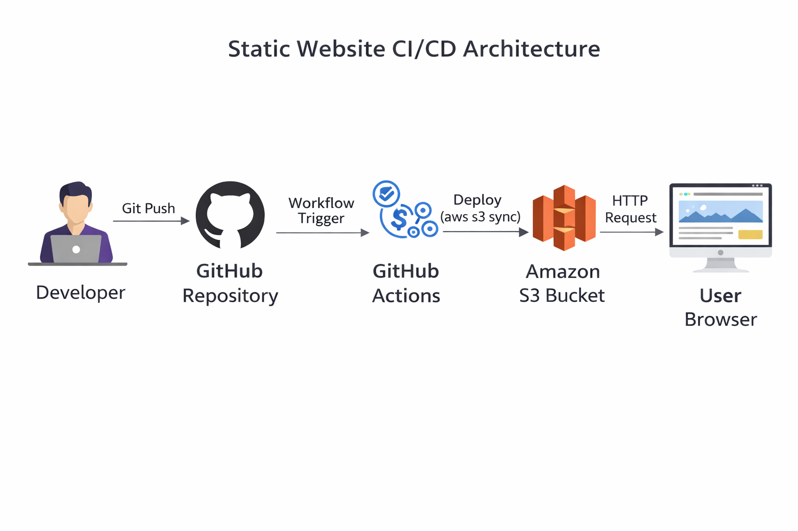
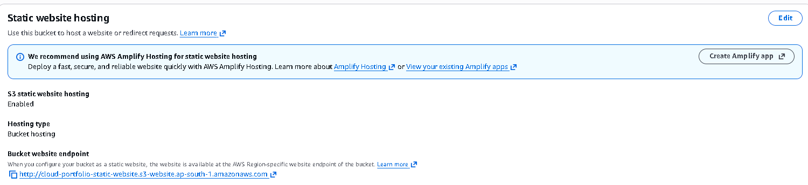
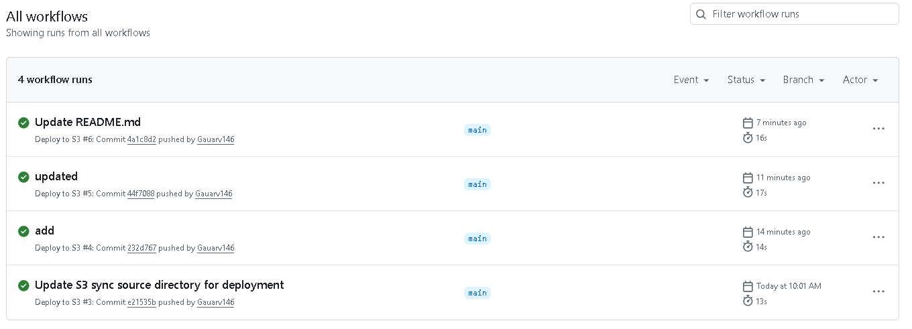

# 🌐 Static Website Deployment with CI/CD on AWS

## 📌 Project Overview

This project demonstrates how to deploy a static website using **Amazon S3** and automate the deployment using **GitHub Actions (CI/CD pipeline)**.

Any code pushed to the repository is automatically deployed to S3, ensuring continuous delivery without manual intervention.

---

## 🏗️ Architecture



### 🔍 Flow Explanation

1. Developer pushes code to GitHub
2. GitHub Actions pipeline is triggered
3. Workflow deploys files to S3 using AWS CLI
4. S3 serves the updated website to users

---

## ⚙️ Tech Stack

* **Amazon S3** – Static website hosting
* **AWS IAM** – Secure access control
* **GitHub Actions** – CI/CD automation

---

## 🚀 Features

* Automated deployment on push to `main`
* Secure credential management using GitHub Secrets
* Lightweight and scalable architecture
* Fully serverless hosting

---

## 📂 Project Structure

Cloud-Engineering-Projects/
│
├── static-website-ci-cd/
│   ├── index.html
│   ├── style.css
│
├── .github/workflows/
│   └── deploy.yml
│
├── images/
│   ├── architecture.png
│   ├── s3.png
│   ├── github-actions.png
│   ├── website.png
│
└── README.md

---

## 🔄 CI/CD Workflow

* Trigger: Push to `main` branch
* Action: GitHub Actions executes deployment workflow
* Deployment: Files synced to S3 bucket

```bash
aws s3 sync static-website-ci-cd/ s3://cloud-portfolio-static-website --delete
```

---

## 🌍 Live Website

http://cloud-portfolio-static-website.s3-website.ap-south-1.amazonaws.com/

---

## 📷 Screenshots

### 🔹 S3 Static Website Hosting



### 🔹 GitHub Actions Pipeline



### 🔹 Website Output


---

## 🔐 Security

* IAM user used instead of root account
* Credentials stored securely in GitHub Secrets
* No hardcoded credentials in repository

---

## 💰 Cost Optimization

This project operates within the **AWS Free Tier**:

* S3 storage and requests are minimal
* No paid services used

---

## 🧠 Key Learnings

* Built a CI/CD pipeline using GitHub Actions
* Automated deployment to AWS S3
* Implemented secure credential management using IAM
* Understood real-world DevOps workflow

---
